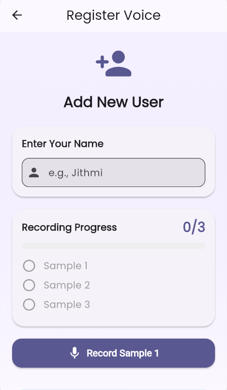
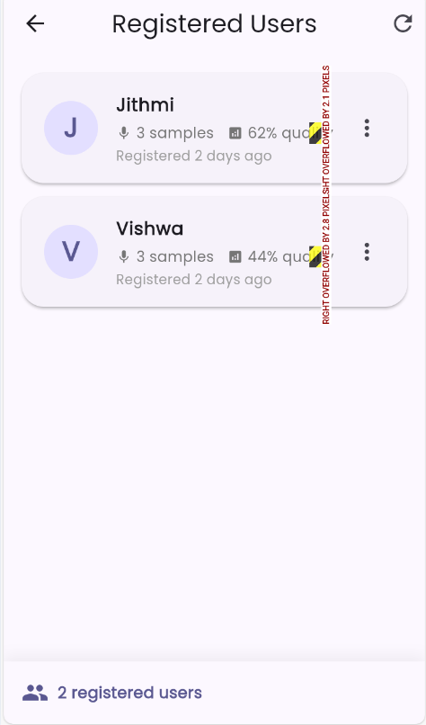

# 🎤 Voice Recognition System for Blind Users

An **AI-powered speaker identification mobile application** designed to help **blind and visually impaired users** identify who is speaking around them using voice recognition technology.

---

## 📖 About the Project

This mobile application allows users to **register voice samples** and later **identify speakers in real time** with high accuracy.  
The system is built with accessibility in mind, providing an intuitive and screen-reader–friendly interface for blind users.

---

## ✨ Features

- 🎙️ Voice registration (3 samples per person)
- 🔍 Real-time speaker identification
- 📊 High accuracy (95%–98%)
- 👥 Supports multiple registered users
- 📱 Android mobile application
- ♿ Accessible UI optimized for blind users
- 📈 Confidence score with color indicators

---

## 📱 Application Screenshots

### 🏠 Home Screen


### 📝 Voice Registration Screen
 

### 🔎 Speaker Identification Screen


> 📌 **Note:** Add your screenshots inside a `screenshots/` folder in the repository and update image names if needed.

---

## 🛠️ Tech Stack

### Frontend
- Flutter

### Backend
- Python 3.11
- Flask
- SpeechBrain (ECAPA-TDNN)
- MongoDB Atlas

---

## 🚀 Quick Start

### Prerequisites

- Python 3.11
- Flutter 3.0+
- MongoDB Atlas account

---

## ⚙️ Backend Setup

```bash
cd backend
python -m venv venv
venv\Scripts\activate   # Windows
pip install -r requirements.txt
```

### Run Backend Server
```bash
python app.py
```
---

## 📱 Frontend Setup
```bash
cd frontend
flutter pub get
```
### Run Frontend Server
```bash
flutter run
```
---
